# The hard way to recover the IBM 5100 Non-executable ROS


I was into the [IBM 5100](https://en.wikipedia.org/wiki/IBM_5100) way before
[John Titor](https://en.wikipedia.org/wiki/John_Titor), if "before" makes sense
with that guy.

Sure, I never used one when they were new, but one of my favourite high school
teachers egged on a budding interest in old computers by giving me some IBM
5100 junk from his undergrad engineering classes: a textbook and a [DC300 tape
cartridge](https://en.wikipedia.org/wiki/Quarter-inch_cartridge). I finally
tracked down a working 5100 a few decades later, although the tape is long gone
now.

Having found one at last, it was worrying to find remarks like this online:


("ROS" is IBM-speak for ROM and stands for "read-only storage".)

I like to [dabble in hardware](https://github.com/stepleton/cameo), but I'm no
[@brouhaha](http://twitter.com/brouhaha). Better to get him that ROS dump now
so that he'll have the replacement worked out before bit rot comes for my own
machine :smiley:

The few times I've had the lid off of my 5100 have all been anxious moments, as
I have no idea where I'd find replacements for any of the ICs or [SLT modules](
https://en.wikipedia.org/wiki/IBM_Solid_Logic_Technology) inside the machine.
I resolved early on that my recovery of the 5100's non-executable ROS---the ROS
that contains the programming for the 5100's BASIC and [APL](
https://en.wikipedia.org/wiki/APL_(programming_language)) interpreters---would
be as minimally-invasive as possible.

In accomplishing this recovery I may have used more compute than all the IBM
5100s ever built have carried out over the past 44 years.

## Table of contents

* [The non-executable ROS in more detail, and stage 1](
  #the-non-executable-ros-in-more-detail-and-stage-1)
* [Stage 2 is video](
  #stage-2-is-video)
* [Machine learning challenges](
  #machine-learning-challenges)
* [Stage 3: image preparation](
  #stage-3-image-preparation)
* [Stage 4 means _training data_](
  #stage-4-means-training-data)
* [Well why don't we just _try_ classifying and call it Stage 5](
  #well-why-dont-we-just-try-classifying-and-call-it-stage-5)
* [Stage 6 uses disagreement to purify the data](
  #stage-6-uses-disagreement-to-purify-the-data)
* [Perhaps a step backwards in Stage 7: masking](
  #perhaps-a-step-backwards-in-stage-7-masking)
* [Fine, then, neural networks for Stage 8](
  #fine-then-neural-networks-for-stage-8)
* [Stage 9 feeds Stage 9 into Stage 9 into Stage 9](
  #stage-9-feeds-stage-9-into-stage-9-into-stage-9)
* [Ensembles: the second trick of classifying, and the first trick of Stage 10](
  #ensembles-the-second-trick-of-classifying-and-the-first-trick-of-stage-10)
* [The eleventh, final stage: vote, and verify](
  #the-eleventh-final-stage-vote-and-verify)
* [Epilogue: what if we had tried to do all of this with IBM 5100s?](
  #epilogue-what-if-we-had-tried-to-do-all-of-this-with-ibm-5100s)
* [Acknowledgements](
  #acknowledgements)
* [Who, where, when](
  #who-where-when)
* **[Comments section](
  #comments-section)**

## The non-executable ROS in more detail, and stage 1

For more information on what the non-executable ROS contains or the very first
steps of saving it, see [this document](DATA.md).

For those who didn't do that, the basic idea is that I can load chunks of the
ROS into the 5100's RAM (or, RWS as IBM likes to call it---"read-write store").
This will be its first stopping place on a lengthy journey.

## Stage 2 is video

The 5100's built-in monitor program, DCP1, lets you page the computer's RAM in
hexadecimal, 32 bytes at a time. You can hold down the up and down arrow keys
and watch the digits stream by. With a [camera pointed at the 5100's display](
https://photos.app.goo.gl/Lu3yT6rHey66j7JP9), I recorded the entire contents
of the non-executable ROS to thirty-two fairly boring videos. Here is a still
frame from one of them:

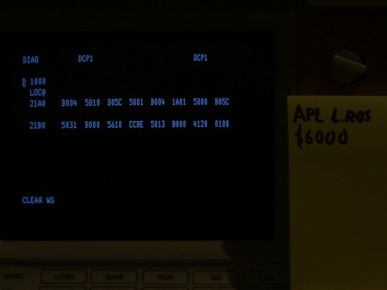

and if that seems exciting to you, the entire one-minute experience of that
portion of the APL ROS is [on YouTube](
https://www.youtube.com/watch?v=Pnn8GQxe56E). The image shows the native
640x480 resolution of the video, since for some reason I was feeling
especially frugal about SD card space at the time.

With the videos on SD cards, the non-executable ROS was rescued at last onto
"modern" computer media, and so job done, I suppose. Still, it wasn't quite
satisfying to leave things this way. People making emulators and hardware
prostheses need bytes, not pictures, and someday I might need them, too.

## Machine learning challenges

With all the data in image form, there should be no further need to open up or
even turn on the 5100 again---perfect for my "minimally invasive" recovery.
All I have to do is work out an automated way to turn the numbers in the video
frames into binary data. As nice as it would be to feed the images into a free
OCR program like [Tesseract](http://tesseract.projectnaptha.com/), these
systems are designed to recognise natural language texts and fail on my hex
dumps. I need to come up with my own solution, and since I'm not going to
transcribe the images by hand (even if I felt like doing that, it would
probably be prone to errors), machine learning is the only practical strategy.

If you've read anything about machine learning in the last ten years, you've
probably encountered these villains:

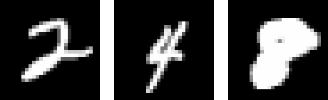

These are three samples from the [MNIST database](
https://en.wikipedia.org/wiki/MNIST_database), a collection of 70,000
handwritten digits as 28x28 greyscale images. MNIST has been called the "Hello
World" of machine learning: a common starter exercise for a
[classification](https://en.wikipedia.org/wiki/Statistical_classification)
system or technique is to throw it at MNIST and see whether it can learn to
recognise digits. In a way, the field of machine learning has been studying
digit recognition devoutly for several decades. This is a good thing, since I
have some digits, too: over three million of them. They come in sets of four,
like this:

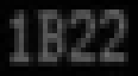

My images are smaller than MNIST: 29x16 (the pictures above are shown "to
scale"). The digits themselves are much more regular than handwriting, but
they're still not perfect. The old display hardware can wiggle display
scanlines around a little bit, light-blocking dust is trapped between the
plastic display shield and the CRT in places, and the screen geometry isn't
perfectly linear in all directions. Sometimes a `B` can look a bit like an `8`
or vice-versa. Speaking of `B`, there's also the fact that I need to classify
the sixteen possible hexadecimal digits instead of MNIST's ten. Then there's
gibberish like this:


Recall that my images come from videos. My camera isn't synchronised precisely
with the 5100 display, and sometimes the (virtual) shutter stays open during
the transition between two pages of digits. The result is a mess:


In addition to recognising the sixteen hex digits 0-9A-F, I'll also need to
have some process for filtering out those non-digits, or else hallucinated
data derived from them will "contaminate" my recovered ROS.

Finally, speaking of contamination, a useful backup requires _perfect
accuracy_. At time of writing, the best reported MNIST classification error
fraction is 0.21%, or 21 in 10,000 ([a
scoreboard](https://benchmarks.ai/mnist); [some background](
https://www.kaggle.com/c/digit-recognizer/discussion/61480)).
This is impressive, but the 5100 will not run properly if even one byte of
its non-executable ROS is out of place. 100% accuracy is a tall order for
machine learning, but with luck the 5100's more regular digits will give it a
fighting chance.

## Stage 3: image preparation

_**Warning!** This section is even more boring than the rest of the writeup.
Feel free to skip ahead._

MNIST digits may be irregularly shaped, but the images they live in are regular
in important ways. The contrast and the brightness have been normalised so that
pixels range in intensity from totally dark (#00) to totally bright (#FF).
Even more importantly: the digits are _centred_. To maximise my odds of perfect
classification, I need to convert my video files into very regular, tiny images
of four-digit clusters like the ones shown above. Here are my steps, listed in
part as commands I ran (from a `bash` shell) on my Linux laptop:

#### 1. Dump the movies to per-frame .png files.

I begin with each of the movies I recorded sitting in its own subdirectory.
That is, I'm assuming this arrangement:
```
./APL/APL_LROS_0000.MOV   ./APL/APL_LROS_2000.MOV
./APL/APL_LROS_4000.MOV   ./APL/APL_LROS_6000.MOV
./APL/APL_LROS_8000.MOV   ./APL/APL_LROS_A000.MOV
./APL/APL_LROS_C000.MOV   ./APL/APL_LROS_E000.MOV

./APL_ii/APL_LROS_ii_0000.MOV   ./APL_ii/APL_LROS_ii_2000.MOV
./APL_ii/APL_LROS_ii_4000.MOV   ./APL_ii/APL_LROS_ii_6000.MOV
./APL_ii/APL_LROS_ii_8000.MOV   ./APL_ii/APL_LROS_ii_A000.MOV
./APL_ii/APL_LROS_ii_C000.MOV   ./APL_ii/APL_LROS_ii_E000.MOV

./BCom/BCom_0000.MOV   ./BCom/BCom_2000.MOV
./BCom/BCom_4000.MOV   ./BCom/BCom_6000.MOV
./BCom/BCom_8000.MOV   ./BCom/BCom_A000.MOV
./BCom/BCom_C000.MOV   ./BCom/BCom_E000.MOV

./BCom_ii/BCom_ii_0000.MOV   ./BCom_ii/BCom_ii_2000.MOV
./BCom_ii/BCom_ii_4000.MOV   ./BCom_ii/BCom_ii_6000.MOV
./BCom_ii/BCom_ii_8000.MOV   ./BCom_ii/BCom_ii_A000.MOV
./BCom_ii/BCom_ii_C000.MOV   ./BCom_ii/BCom_ii_E000.MOV
```
Then:

```shell
# In each movie subdirectory
mkdir 00_originals
# In 00_originals, e.g.
ffmpeg -i ../../APL_LROS_0000.MOV %04d.png
```

#### 2. Crop the per-frame .png files.

This step produces cropped images like the multi-digit "mess" shown just above.
Note the conversion from colour to greyscale. The cropping rectangle (the
argument to the `-crop` flag) was identified by hand.

```shell
# In each movie subdirectory:
mkdir 01_cropped
# In 00_originals:
for i in *.png; do convert -crop 350x75+39+151 +repage -colorspace RGB -colorspace Gray $i ../01_cropped/$i; done
```

#### 3. Trim the per-frame .png files to useful frames.

The beginning and ending of each movie have extra frames that were recorded
while I moved my hands between the camera and the 5100's keyboard. These are
not of much use. I went into each `01_cropped` subdirectory and deleted the
extras by hand, leaving only about five to ten beginning and ending frames.

#### 4. Crop individual 4-digit words.

This step does most of the work. From the coarsely-cropped images in step 2, a
Python program uses a crude [gradient descent](
https://en.wikipedia.org/wiki/Gradient_descent) optimisation procedure to
gradually adjust the locations of tiny cropping windows placed around each of
the 4-digit words.

The technique sounds fancier than it is. The objective is to centre the windows
on the words as precisely as possible---in fact, with subpixel precision (that
is, we'd like to specify the locations of the windows in fractional pixels). To
do this, we iterate the following procedure for each window:

1. Use [image interpolation](
https://en.wikipedia.org/wiki/Bicubic_interpolation) to sample a picture of the
4-digit word within the window.
2. Treating pixel intensities much like physical weights arranged on a grid,
find the "centre of gravity" of the sampled picture.
3. Shift the window slightly in the direction of the centre of gravity---if it
is left-of-centre in the sampled picture, for example, nudge the window
leftward.

Although effective, this procedure isn't perfect. For starters, it takes a long
time: on my slightly-old laptop, the better part of a day to crop all 1,010,070
word-images in the coarse crops from step 3. A more important issue comes from
the "centre of gravity" strategy in the first place: some digits like 8 or B
have more "on" pixels than others like 0 or 1, and so `008B` cropped will not
quite line up with `B800`:


In the end I chose to move on and hope for the best. If I were starting over
from scratch, I might try a different technique that makes use of the
morphological operators and connected components-based methods I used in
[recovering the 5100's executable ROS](
https://github.com/stepleton/5100ExecutableROSDecode/blob/master/Executable_ROS_decode.ipynb).

Code and data files used by this step:
* [crop_word.py](crop_word.py): library for cropping single digit images.
* [crop_words.py](crop_words.py): program for cropping multiple digit images.
* [crop_list.csv](crop_list.csv): initial window locations, prior to
  optimisation; these were created by hand.
* [crop_all_words.sh](crop_all_words.sh): shell script for applying the
  digit-image cropping program to all coarsely-cropped images.

And on the command line:
```shell
# In the top-level directory, make more subdirs:
for i in `find . -name 01_cropped`; do j=`echo $i|sed s/1_cropped/2_words/`; mkdir $j; done
# Now run the cropping script and waaaaaaaaait.
./crop_all_words.sh
```

It's worth mentioning that `crop_words.py` also attempts to adjust image
brightness and contrast, which varies in the original images owing to
[banding](https://electronics.stackexchange.com/questions/251104) from camera
shutter/5100 display synchronisation issues. You can see this banding for
yourself at the [YouTube link](https://www.youtube.com/watch?v=Pnn8GQxe56E)
from earlier.

## Stage 4 means _training data_

Training data is the only essential ingredient for successful machine learning.
All other details are basically fashion decisions.

For a classifier like the one I want to make, training data amounts to pictures
of 4-digit words (the input to the classifier) paired with the correct
numerical label (the four-digit output we'd like the classifier to produce).
For example:

(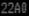, `22A0`)\
(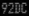, `92DC`)\
(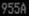, `955A`)\
(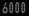, `6000`)\
(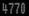, `4770`)

With loads of training data, you can recognise anything simply: just scan all
of your pairs like an enormous identity parade (police lineup) and emit the
label associated with the closest match. This turns out to be [a real machine
learning technique](
https://en.wikipedia.org/wiki/K-nearest_neighbors_algorithm).

As it will turn out, 7,046 of the words in the non-executable ROS---over 4% of
them---will appear there only once. Unless all of these singletons wind up in
the training data, they won't be identifiable via simple matching. More
sophisticated classification methods learn to _generalise_ from training
examples in sophisticated ways, allowing them to decode input that they've
never seen before. This is most of the _learning_ in "machine learning". The
best techniques are distinguished by how much generalisation they can do.

So, if I use a good technique, how much training data will I need? It's
difficult to know. In machine learning research, fully 60,000 of the 70,000
MNIST digits are commonly reserved as training data---over 85% of the entire
dataset. Hoping that I won't need such an extreme ratio, and knowing that my
dataset isn't MNIST, I choose an arbitrary minimum number of training data
examples: 100,000.

### The first 11,000 by hand: a quiet New Year's week

I've got some good friends who've helped me out on various projects over the
years, but I think I'm on my own for the tedious task of labelling all of this
training data. The least I can do is try to make it less painful for myself.

Jotting down labels into a text editor would be pretty slow; instead, I decide
to make a custom program that presents word images and collects digits as fast
as I can type them. It looks like this:


This is an ordinary command-line program with interspersed graphics, made
possible by using a terminal emulator that supports
[Sixel](https://en.wikipedia.org/wiki/Sixel) graphics. This method for showing
screen images inline with text was introduced in the early 1980s by Digital
to provide graphics capabilities for their VT240 and VT241 terminals.

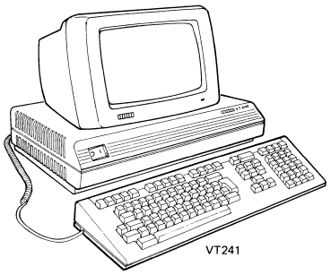\
(_From the [VT240 owner's manual](
http://bitsavers.informatik.uni-stuttgart.de/pdf/dec/terminal/vt240/EK-VT240-UG-003_VT240_Series_Owners_Manual_Dec84.pdf)_)

Since I don't have one of those, I'll use [mlterm](
http://mlterm.sourceforge.net/) on my laptop instead. The program itself
comes in two parts: the interface and a database backend library (where the
"database" is really just an enormous [.csv file](
https://en.wikipedia.org/wiki/Comma-separated_values)). Both are written in
ordinary Python, but the interface makes use of the UNIX-only `termios` and
`tty` modules. (Windows users might be able to get it working under
[cygwin](https://www.cygwin.com/).) Here is the (hastily-written!) code:
* [labelthon.py](labelthon.py): The main program and interface.
* [label_database.py](label_database.py): The database backend.

To use this program, you'll need an empty database first. Assuming you've
followed all of the steps so far, [this one](empty_database.csv.lz),
uncompressed, will work for you. (Beware: it's over 54 MiB, but there's a lot
of duplicated text, so [lzip](http://lzip.nongnu.org/lzip.html) compresses it
down to a measly 255 KiB.) You will need to run the "labelthon" program from a
directory where all of the paths in the database are valid, like so:

```shell
./labelthon.py -n 100000 --mark-apl-ros-c000-zeros database.csv
```

Now you and mlterm are ready to sit down for days and days of hand-labelling.
You've even got a head start: you can tell by watching that all data words in
`APL_LROS_C000.MOV` and `APL_ii_LROS_C000.MOV` (the second filming of the same
thing) are `0000`, so the `--mark-apl-ros-c000-zeros` flag labels all of the
images from those movies accordingly. "labelthon" will select randomly from
the other word images and show them to you, and you'll type in the letters you
see.

Human error is a problem, so the program will want to collect two identical
labellings from you before it believes the label you've chosen for a particular
word image. At a minimum, then, you'll need to type in 200,000 labels, although
due to the way "labelthon" chooses between showing you a new image or asking
you to verify an old one (controllable by flags), you're likely to do even more
than that.

If you see a "gibberish" image like the one above, type `m` to mark it as
nonsense. If the image is clearly `0000` (many word images are, even after
applying `--mark-apl-ros-c000-zeros`), the shortcut `z` saves you from typing
four digits. If you get tired of this madness, type `q` to quit.

On New Years Day, I set to work:\
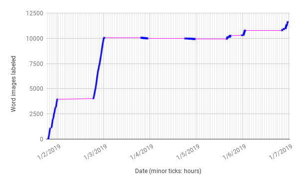

Blue marks show times when I'm working (the database library saves
timestamped backups of the database in the background). The minor horizontal
ticks are hours. The count goes down on the 4th and the 5th because I change
the flags to force "verification mode" and wind up clearing out errors.

By the 6th, BBC iPlayer runs out of episodes of _Ambulance Australia_ to watch
in the background, and I'm pretty tired of typing digits. I consider
crowdsourcing the 90,000 labels I had left to go, but getting reliable results
from crowdsourcing can be harder than it seems, and a browse through
[r/HITsWorthTurkingFor]( https://www.reddit.com/r/HITsWorthTurkingFor/)
suggests that Amazon's gig economy workforce probably has better things to do.
Fair enough---if I don't like the job so much, why inflict it on others?

### To 62,000 labels by logic analyser

What? Yes, I've had a [logic analyser](
https://en.wikipedia.org/wiki/Logic_analyzer) this whole time.

The graph above actually shows a zoom of the overall labelling progress, which
looks more like this:\
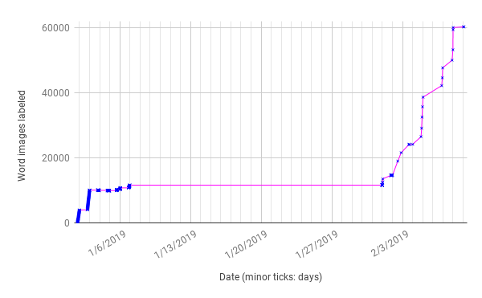

Fed up with labelling by the 7th, I'm off doing other things for a while, but
before long I decide that I ought to save the 5100's executable ROS (the other
important ROS in the computer). This is a different project [described
elsewhere](
https://github.com/stepleton/5100ExecutableROSDecode/blob/master/Executable_ROS_decode.ipynb),
but suffice it to say that it means opening up the 5100 again after I'd hoped
to keep the covers shut. That recovery was fairly straightforward, and I might
have been wise to adapt those techniques to the non-executable ROS, but then
again, [I'd already gone to so much trouble for the existing
approach](https://en.wikipedia.org/wiki/Sunk_cost#Loss_aversion_and_the_sunk_cost_fallacy).

In any case, with the covers off, it's not hard to attach my logic analyser to
the appropriate bus inside the 5100 and re-run [the program that loads
non-executable ROS data into memory](DATA.md). My device, a Rigol MSO2202A-S,
has plenty of memory to record the data from each load. Surely with these
traces I can easily reconstruct the entire non-executable ROS and forget all
about machine learning, right? So, I make my recordings, gently untangle the
logic probes from the 5100's circuitry, and close its case again, hopefully now
for months or even years. A look at the data afterwards reveals two issues:

First, I cleverly forgot to capture any kind of [clock signal](
https://en.wikipedia.org/wiki/Clock_signal) to help identify the boundaries
between bytes in the eight data bit streams I'd recorded. A long stream of
$00 values could be a run of five $00 bytes, or one or three or fifteen. There
is no way to know for certain.

Second, though, my MSO2202A-S is terrible at saving recorded data.


It can store oscilloscope traces in a variety of formats, but as far as I can
tell, only the .csv files it writes contain recordings from the logic probes.
Obviously I have no problem with large .csv files, but the Rigol sure does, as
the files it gives you are corrupt. Occasionally it loses track of the data
it's writing to the file and shovels in a bunch of $00 bytes
(nonprintable---cheeky for a .csv) instead in hopes that you won't notice.
It's not uncommon for several hundred bytes to go missing this way. This graph
shows the damage:


Each tiny bar in this bar chart represents a byte in a recorded data stream.
The height of the bar is how long the byte lingered on the data lines before
a different byte value replaced it. While a legitimate run of identical values
(e.g. fifty $00 bytes in a row) would have a slightly taller bar, the massive
spikes are gaps where the Rigol chose to drop the data.

It might have occurred to me to make multiple recordings of the same data
stream (as I'd done with the videos) since the logic analyser might not have
put the gaps in the same places the second time around. Sadly, this did not
occur to me, and by the time it did, the 5100 was buttoned up once again.

So, to try and salvage the good parts of the recordings I had, I make another
Sixel-enhanced Python program:


This program allows me to align 32-byte snippets of logic analyser data with
screen images from the video, with search features to make it easier to
navigate through the recording. After a snippet is successfully aligned,
pressing the space bar commits the data to the corresponding word images. A
[boring YouTube movie](https://www.youtube.com/watch?v=7Hlkt6nSUzo&t=153) shows
how this program works in more detail.

This way is much faster than typing hex digits by hand. After going through all
of the logic analyser recordings, I recover an additional 50,000 training
examples, give or take. It still takes a few days. Getting training data is a
drag.

Code used by this step:

* [rigol/00_dedup.py](rigol/00_dedup.py): A first preprocessing step for the
  logic analyser recordings, this script filters unprintable characters and
  corrupted lines from .csv files, then deletes successive repetitions of the
  same byte value (essentially achieving a time-based [run-length encoding](
  https://en.wikipedia.org/wiki/Run-length_encoding) of the data).
* [rigol/01_invert.py](rigol/01_invert.py): A simple second preprocessing step
  for recordings that flips all of the bits in the byte data, since the logic
  lines for non-executable ROS data in the 5100 are [active low](
  https://en.wikipedia.org/wiki/Logic_level#Active_state).
* [labels_from_traces.py](labels_from_traces.py): The interactive program for
  aligning preprocessed logic analyser data with video still images, then
  deriving training data from the aligned recordings.

In case you don't have your own MSO2202A-S but still want to use some of this
code, all you need are .csv files made entirely of lines that look like this:
`12345,A7`, or a time in nanoseconds, a comma, and a byte in hexadecimal. You
should also throw in a bunch of NUL bytes here and there for the full Rigol
experience.

Finally, on the command line, assuming you've placed your .csv files in a
subdirectory called `rigol/00_originals`, and you're using a bash-like shell:

```shell
# Preprocess the logic analyser recordings.
mkdir rigol/01_deduped
mkdir rigol/02_inverted

cd rigol/00_originals
for i in *.csv; do ../00_dedup.py $i > ../01_deduped/$i; done

cd ../rigol/01_deduped
for i in *.csv; do ../01_invert.py $i > ../02_inverted/$i; done

# Back in the top-level directory, start aligning recordings to video images.
# Here, we'll try to match data between video and traces for the portion of
# the APL ROS starting at word address $4000.
cd ../../
./labels_from_traces.py database.csv \
    rigol/02_inverted/apl4000.csv \
    ./APL/APL_LROS_4000/01_cropped/
```

## Well why don't we just _try_ classifying and call it Stage 5

I've done about as much labelling as I want to do, and I'm only 60,000 training
examples in, well short of my arbitrary 100,000-example goal. I don't want to
do any more hand-labelling or take the cover off of the 5100 again;
crowdsourcing is out, and an earlier effort to send bytes out of the
[oddly-tilted](https://www.oldcomputr.com/ibm-5100-1975/) I/O ports at the back
of the computer didn't work.

What if I already have enough data? Why not just give classifying a try now?

With hindsight, I can compute my accuracy as I refined the dataset and tried
different techniques over time:


But that's getting ahead of things a bit.

[Support-vector machines](https://en.wikipedia.org/wiki/Support-vector_machine)
(SVMs) are a classic machine learning technique, and since they had worked so
well for the [5100's executable ROS](
https://github.com/stepleton/5100ExecutableROSDecode/blob/master/Executable_ROS_decode.ipynb),
it's natural to try that first. I devise a procedure that actually trains
four [multi-class](https://en.wikipedia.org/wiki/Multiclass_classification)
("multi" since there are 16 ways to interpret a digit: `0`, `1`, `2`, ..., `F`)
SVM-based classifiers simultaneously: one for the first digit, one for the
second, and so on. This was 9 February, and as the leftmost graph point shows,
it works pretty well by machine learning standards, giving an error rate of
0.36%. Sadly, this still means over 3,000 word images are read incorrectly,
and I need to work that down to 0.

At the time I don't actually know the true accuracy of my procedure, but I can
hold out some of my training data as a [test set](
https://en.wikipedia.org/wiki/Training,_validation,_and_test_sets#Test_dataset),
and it shows something similar. So, what follows is the classic machine
learning exercise of _tweaking stuff and seeing what happens_. Beyond SVMs, the
[scikit-learn](https://scikit-learn.org) Python library offers a smörgåsbord of
plug-and-play multi-class classification techniques, and each one of those
comes with configuration options as well.

I can't remember everything I try, but when I see the test set accuracy start
to plateau at an error rate just over 0.15%, it suggests I've hit tweaking's
limits. My training data probably isn't comprehensive enough to teach these
algorithms all the varied ways that digits can look, and perhaps it even has
some flaws in it.

As it turns out, though, even errors in classifiers can be useful.

Code used by this step:

* [labels_classification.py](labels_classification.py)
* [labels_diff.py](labels_diff.py)

And some commands:

```shell
# Try classifying the data, using the "ground truth" labels in `database.csv`
# and placing the results in `database_classified_00.csv`.
./labels_classification.py database.csv database_classified_00.csv

# Edit the `train_classifier` function in the classification code to try
# a different type of scikit-learn classifier.
vi labels_classification.py

# At this point you'd repeat the above two commands, writing results to a new
# `database_classified_XX.csv` file each time. Each file will be slightly
# different due to different methods and the way the program randomly allocates
# data to the training and test sets (so, it learns from different data each
# time. In order to see how two classifications disagree (in this example, the
# sixth and the thirteenth), you can do this:
./labels_diff.py \
    database_classified_05.csv \
    database_classified_12.csv \
    --skip-XXXX-from=database.csv

# The last flag causes the diff to ignore label images that were marked as
# nonsense in the "ground truth" database. You can use a similar invocation
# to inspect how the classifier chose to classify the ground truth data
# itself---a good way to spot the kinds of mistakes the classifier makes, or
# in some cases find errors in the ground truth labels themselves. You'll see
# this idea crop up again later, too...
```

## Stage 6 uses disagreement to purify the data

Now and then a machine learning paper makes an impressive show of referencing [
one of the most famous opening lines in all of literature](
https://en.wikipedia.org/wiki/Anna_Karenina#Plot_summary). Papers that do this
are all alike. They observe that collections of classifiers (or other kinds of
learning systems) all tend to produce the same answer when they evaluate
unambiguous data, but then yield different answers when applied to messy,
noisy information. By now I've got plenty of classification results from
[Stage 5](#well-why-dont-we-just-try-classifying-and-call-it-stage-5), and
thanks to [the garbled digits that we saw show up during transitions between
frames](#machine-learning-challenges), I've also got plenty of messy, noisy
information for the results to disagree about.

I decide to write another program that detects these disagreements and allows
me to flag all word images from the corresponding video frame as ignorable
nonsense. The interface looks like this:


Operation is straightforward: you view each cropped video frame that yielded
images that caused the classifiers to disagree, then specify whether the frame
had garbled digits. I'm able to mark word images from over 7,000 video frames
as invalid using this tool, flagging nearly all of the corrupt label images.

Code used by this step:

* [labels_exploit_disagreement.py](labels_exploit_disagreement.py)

Command:

```shell
# The first argument is the database to modify, the second is the name we gave
# to subdirectories holding per-frame cropped images, and the rest list at
# least two databases of classification results that we want to compare to find
# disagreements.
./labels_exploit_disagreement.py \
    database.csv \
    01_cropped \
    database_classified_05.csv \
    database_classified_12.csv
```

## Perhaps a step backwards in Stage 7: masking

Marking garbled images label was a useful step (it helps `labels_diff.py`
ignore meaningless disagreements between classification results, for example),
but it hasn't really changed the ground truth data that trains the classifier.
I'm still just about as far on that front as I was after [Stage 5](
#well-why-dont-we-just-try-classifying-and-call-it-stage-5). By now, though,
I've started to think about an even fancier tweak to try: masking each digit in
word images prior to any classification.

Generic classification methods like the ones I'm using don't come with
sophisticated preconceived notions about the data they're analysing. Even
though _people_ know that, generally speaking, none of the other digits ever
affect the fact that the second digits of `540C` and `144A` are both `4`, my
classifier has no such built-in bias. For all it knows, in the rare cases where
the last three digits are `473` or `4AB`, it should emit `5` instead of `4` for
the second digit. Why not? The classifier has no real notion of "four" or
"five" or "digit" or "second". All it sees are abstract patterns of pixels with
certain measurable similarities. Why should one subset of the pixels be more
important than any other subset?

So, it occurs to me that it might be beneficial to contribute my own problem
understanding to the process. If the classifier for the second digit only saw
images with all of the other digits censored, it wouldn't need to learn on its
own to ignore the other digits, and less to learn means less training data is
needed. Maybe we wouldn't need 100,000 ground truth labels after all.

Thus, from each word image, I'd like to derive four masked images like these:


My strategy for segmenting the digits is simple. Summing all of the columns
of pixels in the image gives you a one-dimensional graph of peaks and valleys.
The gaps between digits form the deepest valleys, since these gaps have only
dark pixels and sum up to small values:


Regrettably, this method doesn't always work. In some images, digits abut
so closely that their gaps are not so dim after all:


Here, the third-deepest valley turns out to be the middle column of the
trailing `C` digit, just barely---so my approach can be fooled. I don't realise
this right away, but my first classification results with masking enabled are
so much poorer that they form their own valley: the deepest in the progress
graph [shown earlier](
#well-why-dont-we-just-try-classifying-and-call-it-stage-5). After spotting the
problem, I try mitigating it with quick hacks like allowing digit splits to
occur only on certain columns, and that works most of the time. Of course,
sometimes it doesn't:


In the end, the masking tweak seems to wind up being a wash, trading familiar
kinds of errors (partly attributable to the classifiers not "knowing" to limit
their scope to a particular digit and nothing else) for new kinds (badly-masked
images). Additionally, it's not 100% clear that the classifiers really _should_
ignore other digits. Just as seeing the letter Q in English text makes it
likely that the next letter will be a U, some patterns recur in the ROS data.
If the first digit of a word is `4`, the second will be `7` over 3/8ths of the
time. Nearly one time in nine, the entire word will be `47f0` (an unconditional
jump instruction in System/370 machine code). Our classifier might do better
if it has the opportunity to learn and exploit these regularities.

Either way, after some hacking to improve the masking, classification accuracy
does climb back up out of the deepest valley, but this probably has more to do
with something else I'm trying at the same time...

Code used by this step:

* [labels_classification.py](labels_classification.py) (once again)
* [show_digit_mask.py](show_digit_mask.py)

Commands:

```shell
# The new --mask-digits flag enables the most refined (i.e. tweaked) version
# of the digit masking described above.
./labels_classification.py --mask-digits database.csv database_classified_25.csv

# Or, to visualise digit masking at work on a word image, provided your
# terminal supports Sixel graphics:
./show_digit_mask.py APL/APL_LROS_0000/02_words/0314_0_1.png
```

## Fine, then, neural networks for Stage 8

So far the classifier techniques I've been using are well-established,
well-understood methods with interpretable inner workings and strong
theoretical guarantees. Who cares about rigour, though, when there's a
massively hyped method that works even better?

Simple feed-forward [neural networks](
https://en.wikipedia.org/wiki/Neural_network) are explained in countless [
YouTube videos](
https://www.youtube.com/watch?v=aircAruvnKk&list=PLZHQObOWTQDNU6R1_67000Dx_ZCJB-3pi),
so it suffices for here to say that I try them out. The scikit-learn package
I've been using includes such networks in its suite of classifier methods, so
putting them to work requires only an easy modification of my code. Next, since
nobody knows the "right way" to design a neural network (in this case, to
choose the number and size of its layers, among other [hyperparameters](
https://en.wikipedia.org/wiki/Hyperparameter_(machine_learning))), the only
thing to do is "wing it" and try a bunch of configurations. By the time I get
bored of doing that, my last network has three hidden layers of 50, 40, and 30
[ReLU](https://en.wikipedia.org/wiki/Rectifier_(neural_networks)) units. I
can tell from results on the test set that performance is considerably
better than what the other methods had achieved, with misclassifications
now down in the single and low double digits.

I'm convinced I could improve even further, though. Virtually all neural
networks that do serious image processing make use of [convolutional layers](
https://en.wikipedia.org/wiki/Convolutional_neural_network), about which there
are abundant further [explainey YouTube videos](
https://www.youtube.com/watch?v=TJlAxW-2nmI). It has been Officially Decided
that these very capable and ubiquitous network structures are [out of scope](
https://github.com/scikit-learn/scikit-learn/issues/11811) for scikit-learn,
though, so I switch to using [Keras](https://keras.io/), a "real" library for
neural networks. Once again, random tweaking is the lowest effort way to
explore the space of network architectures. In later stages, I settle on a
network with a single 16 3x3 filter convolutional layer, a 2x2 max-pooling
layer, and then two hidden layers similar to the first two from the previous
network.

It takes longer to train the new network in any configuration: much longer,
nearly half a day (remember, my laptop is no speed demon). The network is more
complicated this time, and it happens that I'm also processing about six times
more data in training now than I was before, but the runtime increase still
seems disproportionate. Oh well. When training completes at last, the
performance improvement is present, but slight: perhaps one or two fewer
test-set misclassifications. 100% correctness is closer than ever, but it still
feels a long way off.

Code used by this step:

* [labels_classification.py](labels_classification.py) (for the last time)
* [labels_classification_keras.py](labels_classification_keras.py)


Commands:

```shell
# Both classification programs are invoked in the usual way.
./labels_classification.py database.csv database_classified_30.csv
./labels_classification_keras.py database.csv database_classified_31.csv
```

## Stage 9 feeds Stage 9 into Stage 9 into Stage 9

Once again, the secret to all successful machine learning is training data. If
the classifier needs improvement, get more training data.

I'm still stuck at 60,000 training examples without any appetite for making
more. The results of my existing classifiers are pretty good, but still not
perfect. Well, fine, what if I just use these results themselves as training
examples?

Most practitioners would regard this idea as risky, generally speaking. An
error in a classifier's output-turned-training-data could be amplified in an
"offspring" classifier that learns to replicate the mistake; after enough
generations, several of these errors might proliferate, causing the
classifications to become increasingly nonsensical. There is another
possibility, though: the abundance of correct labels could overwhelm the
sporadic errors and draw successive generations of classifications toward a
more consistent and correct final output. Mathematically, we are suggesting
that this iteration of training and classification converges toward a useful
[fixed point]( https://en.wikipedia.org/wiki/Fixed_point_(mathematics)). If `x`
is the original training data, we could call the function

    f(x)

the output of training a classifier on the original training data and then
computing its classification of the entire dataset. Next,

    f(f(x))

would be the result of training a second classifier on the result of the first
and obtaining its classification of all of the data. This iteration can
repeat as often as you like, so

    f(f(f(f(f(f(f(f(x))))))))

would be eight generations away from the training data we made in [Stage 4](
#stage-4-means-training-data). Is this actually worthwhile? Will this process
converge on anything useful? Neural networks are so complicated that no
mathematics exists today that would help us answer this question using theory
alone---the only way to find out is to try it and see what happens.

To be honest, I'm not quite that brave. If I do exactly this iteration without
any intervention, my suspicion is that the procedure _will_ have a fixed
point---a very boring one! Consider the classifier for the first digit: a
relatively minor, random error might cause one generation to misclassify the
first digit of a few training examples as a `3`; in the next generation, the
output `3` covers slightly more of the input and may cause the first digit in
several more images to receive a `3` misclassification; this process repeats
and reinforces itself until, many generations later, _all_ digits are
classified as `3`! I never try this "pure" iteration and so don't know if this
is what would really happen, but I think it's pretty likely.

Instead, I use an approach with two modifications. First, rather than train
"offspring" classifiers on the entire output of their parents, I only use 60%
of the parents' output. I don't bother writing a formal program for this:
instead, I just run a throwaway snippet in an interpreter:

```python
with open('database.csv', 'r') as din:
    with open('database_classified_40.csv', 'r') as dc:
        with open('database_tmp_hybrid.csv', 'w') as dth:
            while True:
                l1 = next(din)
                l2 = next(dc)
                num = int(l1.split(',')[2][1:-2]) if count > 0 else 2
                count += 1
                if num >= 2 or random.random() < 0.6:
                    dth.write(l1)
                else:
                    dth.write(l2)
```

(It's not even slightly good code! I couldn't be bothered to use
`itertools.izip`, so the loop terminates with a `StopIteration` exception.)

My reason for omitting the entire dataset relates to the Anna Karenina gimmick
discussed in [Stage 6](#stage-6-uses-disagreement-to-purify-the-data).
"Iterated retraining" (for lack of a better term) will lead to the "[generation
loss](https://en.wikipedia.org/wiki/Generation_loss)"-like errors I worry about
above, but my hope is that the subsampling will increase the diversity of the
errors that emerge from one generation to the next, making it a bit less likely
that successive generations will repeat the same mistakes.

This diversity is also helpful for the second modification to the "pure"
iteration, as a prompt for manual intervention. After computing the next
generation of classifier outputs, I compare it to several of the earlier
outputs and manually supply the correct classification answer. I do this in
hopes of stopping any remaining gradual inter-generational error proliferation
right when it starts. For this slightly more complicated operation, I write
another custom program:


This program lets me resolve disagreements between classifier outputs
myself---a handy way to provide additional training data labels for word images
that might be critically ambiguous. Sometimes I find more garbled digits I'd
missed in [Stage 6](#stage-6-uses-disagreement-to-purify-the-data), so I can
also mark entire frames as invalid.

Soon the strategy seems like it might be paying off. The number of
misclassified word images in the test data falls into single digits. Busy with
other things (or maybe I'm just getting bored), I spend over a month in a daily
routine of resolving classification disagreements, sampling new training data,
tweaking the network parameters, and kicking off a new training+classification
iteration to run in the background. Errors remain few; sometimes they even fall
to zero. Is this real performance, though, or is each new classifier generation
increasingly delusional?

Code used by this step (besides the quick-and-dirty Python):

* [labels_resolve_disagreement.py](labels_resolve_disagreement.py)

Commands:

```shell
# The first argument is the database to modify, the second is the name we gave
# to subdirectories holding per-frame cropped images, and the rest list at
# least two databases of classification results that we want to compare to find
# disagreements.
./labels_resolve_disagreement.py \
    database.csv 01_cropped \
    database_classified_44.csv \
    database_classified_45.csv
```

## Ensembles: the second trick of classifying, and the first trick of Stage 10

After a month of kicking the can down the road, I can't put it off any longer.
It's time to try compiling all of my classified word images into the
non-executable ROS data.

Even though I'm seeing very low error rates on the test data, it seems unwise
to trust the results of a single classifier run. Instead, it's probably better
to collect "votes" across multiple classifications and go with the majority
interpretation. In machine learning, this is a kind of [ensemble method](
https://en.wikipedia.org/wiki/Ensemble_learning), a class of old tricks that
have helped obtain contest-winning classifier performance now and then over the
years. In particular, it's very similar to a method called "[bagging](
https://en.wikipedia.org/wiki/Bootstrap_aggregating)". The main difference is
the way I train new classifiers on old classifier output---in machine learning,
such approaches are known as "totally weird".

Not only can I combine classifications from different classifiers, I can also
combine them across multiple video frames, since each "page" in the DCP1
monitor program stays on the screen for around a tenth of a second (about three
frames), and also because I recorded all the data twice for redundancy's sake.
It's very helpful too that the DCP1 display always shows the memory locations
of the data on the screen:


Those are the words in the magenta box. To the right of `1AE0` are the 16 bytes
of data stored at that location, and likewise for `1AF0` beneath it. So, here's
the plan:

- Collect several recent classifier runs from [Stage 9](
  #stage-9-feeds-stage-9-into-stage-9-into-stage-9). Then examine each
  classifier run:

  - For each video frame in the classifier run, note which chunk of the ROS
    was being recorded (recall from [Stage 1](
    #the-non-executable-ros-in-more-detail-and-stage-1) and [Stage 2](
    #stage-2-is-video) how the whole ROS had to be split across sixteen
    separate videos---although I have 32 videos from recording each chunk
    twice). Then:

    - For each data word in the frame, identify its memory location from its
      position in the image along with the values of the address words at left
      (as read by the classifier).

    - Record a "vote" for the classifier's reading of the data word as the
      value of the data at the deduced memory location in the current ROS
      chunk.

I write a program that assembles these votes into a text database and run it on
the outputs of the 28 most recent classifier runs. Even though most memory
locations receive comfortably more than 100 votes each, I'm surprised by the
degree of consensus: there are only 137 words in the entire ROS that receive
multiple interpretations, and only one of them has three readings (the rest
have only two). In nearly all cases, the majority is overwhelming, with
runner-up interpretations claiming only one or two votes.

Huh. With a little bit of mental arithmetic you can convince yourself that, in
a sense, I've put in a lot of unnecessary effort. It must be the case that for
most of my classifier runs, I could examine the run individually and, by
counting votes from different frames for just that run, achieve the same
majority interpretation of the entire dataset that I get from considering all
of the classifier runs together. There just simply aren't enough disagreements
for more than one or two of the classifier runs to have a different voting
result.

Oh well. Anyway, it's 2019. Everyone knows by now that a majority vote is no
guarantee of a good outcome. All of my classification results may agree, but
they could still be deluded in the same way. Ponder that one, Tolstoy...

Code used by this step:

* [assemble_labels.py](assemble_labels.py)
* [assemble_all_labels.sh](assemble_all_labels.sh)

Commands:

```shell
# Unlike other stages, this stage operates the assemble_labels.py program with
# a shell script. You should edit it first and specify the classifier outputs
# you'd like to poll for votes.
vi assemble_all_labels.sh

# Then just run the script. The result is a handful of text vote tally
# databases with names like assembly_APL_LROS_6000.txt, one for each of the
# chunks of non-executable ROS from the original video recordings.
./assemble_all_labels.sh
```

## The eleventh, final stage: vote, and verify

The votes are in. If the majority are correct, I might be nearly finished, so I
rush to supply all of the missing pieces. First is a small program, written
even more hastily than usual, to take the tally databases compiled by
`assemble_labels.py` and emit binary data reflecting the most popular
interpretations of each of the word images.

Soon I have two candidate binary ROS dump files, one for the APL interpreter
and one for the BASIC interpreter and the common ROS. At 128 KiB each, both are
larger than they need to be: APL should only take 96 KiB, and the BASIC/common
code only uses 54 KiB. I'm still hopeful that the true data is embedded
somewhere within. To find it, and to check that the decoding was correct in the
first place, I'll use the same data integrity check that the IBM 5100 uses to
make sure the non-executable ROS is in good shape.

When you flip the big red switch to turn on an IBM 5100, the computer growls to
life and immediately begins its bring-up diagnostic. Gradually probing its
internal mechanisms, starting from the most fundamental logic and memory
components and working outward to the interfaces and stored programs that it
uses to interact with the world, it marks progress with letters of the alphabet
printed to the top-left corner of the screen. The most interesting test to us
is the ninth, where the computer begins by displaying this:

     ABCDEFGHI
    18

The 5100 is testing the integrity of the non-executable ROS. `18` is the first
portion the computer examines: it refers to a 6144-byte chunk of "common" code.
Next, the bring-up counts through additional portions of the ROS depending on
which language you've selected: if APL, sixteen of them numbered sequentially
as `20` through `2F`. BASIC uses only eight marked `10` through `17`. (You can
watch [a video of my 5100 doing both sequences](https://youtu.be/exJeh9EFRaI).)

The integrity check for each chunk uses a 16-bit CRC calculation ([excellent
video lesson](https://www.youtube.com/watch?v=izG7qT0EpBw)). To apply the same
check on a more modern computer, I first had to identify exactly what the 5100
was doing in [a disassembly of the 5100's executable ROS](
ftp://ftp.informatik.uni-stuttgart.de/pub/cm/ibm/ibm5100/execros.asm), and
after an evening of digging (aided by early hints from Christian Corti in that
linked disassembly), I spotted the key loop at memory location $5F3C and the
core of the calculation at $5F94. I might have carefully analysed its
operations and devised an implementation of the same algorithm in a
contemporary language, but honestly, it was much easier to do this:

```python
def update_crc(byte: int, crc: Tuple[int, int]) -> Tuple[int, int]:
  """Update a 16-bit CRC given a new byte."""
  # Set up the 16 registers of the 5100.
  r = [(0, 0) for _ in range(16)]
  r[9] = (crc[0] & 0xff, crc[1] & 0xff)
  r[10] = (0, byte & 0xff)

  r[14] = (r[14][0], r[9][0])                                   # MHL R14, R9
  r[14] = (r[14][0], r[14][1] ^ r[10][1])                       # XOR R14, R10
  r[1] = r[14]                                                  # MOVE R1, R14
  r[15] = r[14]                                                 # MOVE R15, R14
  r[15] = (r[15][0], (r[15][1] << 4 & 0xff) | (r[15][1] >> 4))  # SWAP R15
  r[14] = (r[14][0], r[14][1] ^ r[15][1])                       # XOR R14, R15
  r[14] = (r[14][0], r[14][1] & 0xf0)                           # CLR R14, #$0F
  r[14] = (r[14][0], r[14][1] ^ r[9][1])                        # XOR R14, R9
  r[9] = r[1]                                                   # MOVE R9, R1
  r[15] = (r[15][0], r[15][1] & 0x0f)                           # CLR R15, #$F0
  r[9] = (r[9][0], r[9][1] ^ r[15][1])                          # XOR R9, R15
  r[1] = (r[1][0], (r[1][1] << 5 & 0xff) | (r[1][1] >> 3))      # ROR3 R1
  r[15] = r[1]                                                  # MOVE R15, R1
  r[15] = (r[15][0], r[15][1] & 0x1f)                           # CLR R15, #$E0
  r[14] = (r[14][0], r[14][1] ^ r[15][1])                       # XOR R14, R15
  r[1] = (r[1][0], r[1][1] & 0xe0)                              # CLR R1, #$1F
  r[9] = (r[9][0], r[9][1] ^ r[1][1])                           # XOR R9, R1
  r[15] = (r[15][0], (r[15][1] << 4 & 0xff) | (r[15][1] >> 4))  # SWAP R15
  r[1] = r[15]                                                  # MOVE R1, R15
  r[15] = (r[15][0], r[15][1] & 0xe0)                           # CLR R15, #$1F
  r[9] = (r[9][0], r[9][1] ^ r[15][1])                          # XOR R9, R15
  r[1] = (r[1][0], r[1][1] & 0x01)                              # CLR R1, #$FE
  r[14] = (r[14][0], r[14][1] ^ r[1][1])                        # XOR R14, R1
  r[9] = (r[14][1], r[9][1])                                    # MLH R9, R14
  return r[9]                                                   # RET R8
```

In other words, I set up a Python array of tuples like the 5100's registers and
carefully manipulated them step-by-step in the same way the machine
instructions from the CRC update routine do. I still have no idea how this code
works, and there's no reason I'll ever need to learn.

Time to find out whether my decoding has succeeded:


Sure enough. Just like that, the IBM 5100 non-executable APL ROS is
"officially" recovered as the 96 KiB at the beginning of the binary data
"undumped" by our ensemble of neural networks. A slightly more complicated
exploration procedure was required to understand the layout of the raw
BASIC/common ROS data (see [the data supplement](DATA.md) for details), but
before long this was recovered as well.

Code used by this step:

* [assembly_to_binary.py](assembly_to_binary.py): Compile tally databases from
  [Stage 10](
  #ensembles-the-second-trick-of-classifying-and-the-first-trick-of-stage-10)
  into binary data.
* [finalise.sh](finalise.sh): Assemble the final ROS data files from the "raw"
  binary files derived from the tally databases.
* [binary_check.py](binary_check.py): Perform the 5100's own 16-bit CRC
  integrity check on binary data.

Commands:

```shell
# Compile tally databases into "raw" binary data files for the APL and
# BASIC/common non-executable ROS.
./assembly_to_binary.py assembly_APL_LROS_* > binary_APL_LROS_raw_undump.bin
./assembly_to_binary.py assembly_BCom_* > binary_BCom_raw_undump.bin

# Extract actual ROS data from the raw files.
./finalise.sh

# Validate the contents of the final recovered data.
./binary_check.py binary_APL_LROS.bin
./binary_check.py binary_BCom.bin
```

## Epilogue: what if we had tried to do all of this with IBM 5100s?

Well, it would have taken a heck of a lot longer---and about a tonne and a
half of the machines.

To start, let's take one of the simpler neural networks used in this
project---the ordinary feed-forward neural network with three hidden layers of
size 50, 40, and 30. Input images have 29 * 16 = 464 pixels, so if we only
count multiplications (and not additions or other operations), a single
classification operation for a single digit requires

      464       50       40       30
    x  50     x 40     x 30     x 16
    -----     ----     ----     ----
    23200  +  2000  +  1200  +   480  =  26880 floating point multiplications.

We have 1,010,070 word images in our dataset and four digits per word image.
Evaluating all of the digits therefore requires the computer to multiply over
108 billion times.

The IBM 5100's processor runs at just under 2 MHz, and if we assume that each
instruction takes one cycle (which I suspect is unlikely), that's 500ns per
operation. The processor's arithmetic unit only handles eight-bit
integers---larger ones must be processed piecemeal---and it possesses no
integer multiplication or division operations. Don't even think about floating
point numbers: you do all of that in software. How? Well, some Googling
suggests that similarly-impoverished microcontroller programmers sometimes use
a technique called [Horner's method](
https://en.wikipedia.org/wiki/Horner%27s_method#Floating-point_multiplication_and_division),
which can do floating point multiplication and division using only additions
and [bit-shifts](https://en.wikipedia.org/wiki/Bitwise_operation#Bit_shifts).
[This article](
https://www.nutsvolts.com/magazine/article/floating_point_multiplication_and_division)
shows a microcontroller implementation of multiplication in 32 operations,
although it's really multiplication by one hard-coded factor---to change the
factor, you would need to rewrite the code. Very well, though, let's generously
consider 32 operations a rule-of-thumb (under)estimate of how many operations a
5100 spends to do a floating point multiply, or, in other words, 16
microseconds.

Under these very friendly assumptions, classification of a single digit will
take 16us * 26880 = 430.1ms, a bit under half a second. To classify the entire
dataset of over four million digits, then, a 5100 would take a little more than
twenty days to accomplish the multiplications alone. This only applies, though,
if we have a fully-trained neural network; what we also need to know is how
long it must have taken our 5100 to arrive at this network in the first place.
The training regime in [labels_classification.py](labels_classification.py)
specifies that our learning procedure carry out up to 10,000 iterations of
training on 5,000-image batches sampled from the dataset, so in addition to
the million word images to classify at the end, we need to think about the
50,000,000 word images the computer must process during training. That many
images takes

    20.11 days * 50000000 / 1010070 = 988.88 days = 2.73 years

of multiplying, although our training procedure might stop sooner if it senses
that it's doing particularly well. Still, we've been pretty generous in our
estimates, so we can probably hedge a bit in the opposite direction too.

So far our multiplication count has only concerned the process of evaluating an
image with a classifier---what's known in neural networks as the "forward
pass". To actually update the network's parameters so that it learns to make
better predictions, you have to compare its classifications to the actual
ground truth labels from the dataset, determine how wrong the network was in
its classifications, and then go back and tweak all of the network parameters
so that they won't be quite so wrong next time. This is called
[backpropagation](https://en.wikipedia.org/wiki/Backpropagation) or the
"backward pass", and we had better account for it in our estimate, too. For
this, let's just multiply our 2.73 year tally by two, giving 5.45 years. We
mustn't forget to add on the final 20-day classification for all of our data,
which brings us up to 5.47.

Of course, I never trained just one neural network---thanks to continued
tweaking and the "inbreeding" of [Stage 9](
#stage-9-feeds-stage-9-into-stage-9-into-stage-9), I wound up training about
49 of them. For the 5100, we're now a month and some change shy of _270 years_.

Let's change units. The 5100 was introduced late in the summer of 1975---about
44 years ago. If we had bought some 5100s when [Rod Stewart's "Sailing"](
https://www.youtube.com/watch?v=FOt3oQ_k008) topped the UK charts and set them
all right to work, we would have needed (270 ÷ 44) just over six of them
running flat-out around-the-clock to be done today.

Recall that the 49 networks weren't all like the one we've just examined---we
did switch to a more complicated network and a different learning system
altogether at one point, so perhaps we should update our estimate. Our new
network's convolutional layer alone would have required something like

    29 * 16 * 3 * 3 * 16 = 66816

multiplications on its own to process a single image. The subsequent
max-pooling operation would then reduce the result to a 14 * 2 * 16 = 448-value
quantity, so the new number of multiplications would become

                448       48       38
              x  48     x 38     x 16
              -----     ----     ----
    66816  +  21504  +  1824  +   608  =  90752

A classification of all of the word images now takes just under 68 days on the
5100, but I guess it's worth it for the improved accuracy.

Switching to Keras for the new network meant rewriting the training code to
some degree. I didn't pay very close attention as I was writing it, but where
we had previously processed 50,000,000 word images during training, the new
[Stage 9](#stage-9-feeds-stage-9-into-stage-9-into-stage-9) training methods
were examining 312,000,000 of them. This would occupy the 5100 for about eleven
days more than 115 years; or, for the 26 networks I trained in this way, nearly
2,991 years altogether. Or, if you preferred in 1975, you could start the work
on 68 5100s running in parallel and receive the answer today. (Let's not
forget to allocate an additional three 5100s to tackle the 23 earlier networks,
which were mostly much simpler.)

I haven't been able to find out how many IBM 5100s were built. [This timeline](
http://kpolsson.com/ibmpc/) cites a New York Times article claiming that IBM
shipped 6,000 "desktop computers" in 1980, a year before it unveiled the IBM PC
and a time when multiple options like the 5110 and 5120 were available for
sale. Prices were similar to the 5100's, though, so let's say that IBM achieved
similar sales from '75 through '78, when the 5100 was discontinued. That's
18,000 machines total. I suspect this may be an overestimate.

If we take the 44 years spent by 71 machines and spread it out across the
entire fleet, our project would require all 5100 owners to donate

    44 * 365.25 * 71 / 18000 = 63.39 days

of continuous operation to our project. That's not too bad, but let's respect
the eight-hour workday: a bit over 190 days, or 73% of an American work year.

How much use did an average 5100 get over its lifespan? 190 full work days
sounds fairly normal; maybe an underestimate. Remember though that I've made a
lot of other low estimates. If I'm under by a factor of 10 through a
combination of underestimates (and I suspect the estimated number of cycles
needed by floating-point multiply could be that far off on its own), then we
need 7.3 work years per machine from the whole fleet, and I doubt there were
more than a few hundred IBM 5100s in regular use in 1983.

Did my project to recover the non-executable ROS then use more compute
(specifically, multiplications) than all the 5100s ever made have ever used in
their entire history? I don't really know, but I like my odds.

## Acknowledgements

- Christian Corti's excellent IBM 5110 technical webpage ([German](
http://computermuseum.informatik.uni-stuttgart.de/dev/ibm_5110/technik/5110.html),
[English](http://computermuseum.informatik.uni-stuttgart.de/dev/ibm_5110/technik/en/index.html))
as well as helpful remarks from Christian over email.
- The source code for Christian's IBM 5110 emulator (available at the same link, or [try it in your web browser](
http://members.aon.at/nkehrer/ibm_5110/emu5110.html)), which helpfully
clarified what certain IBM 5100/5110 instructions really did.
- [bitsavers.org](http://www.bitsavers.org/), for its archived [IBM 5100](
http://bitsavers.informatik.uni-stuttgart.de/pdf/ibm/5100/) and [IBM 5110](
http://bitsavers.informatik.uni-stuttgart.de/pdf/ibm/5110/) technical
documentation.
- Andrew M. for technical advice.

## Who, where, when

Tom Stepleton, London, 2019-06-27

---

# Comments section

_If you'd like to add a comment of your own and make this document **even
longer**, edit this file and copy the template that follows to just above this
text. When you're done, send a pull request against head on this repository and
I'll merge it, provided it's not objectionable. Should work for a low-traffic
discussion (but then will there be any traffic at all?)._

> **Here's the title of my comment**\
> by @stepleton, 2019-06-27 12:34 BST

The body of the comment goes here. This is a pretty practical way to host a
discussion forum, for sure! Just remember that the most important thing is to
include the backslash character after your title.

Reading an ibm5100 ROS card\

Hello Mr. Stepleton,

First, thank you very much for your fantastic and tremendous work on recovering the ibm ROS.

My question is the following. Do you have the timings/protocol to read the ROS card?

I'm trying to read my Basic ROS (Slot C4-C2) using a Teensy (Arduino), but no luck yet. My goal would be to build a card using a standard Flash/EEPROM chip if at all possible.

If you're interested, I could attach a picture of my messy wires connections and the source code (.ino) for the Teensy. (Keep in mind that I'm at the beginning stage of trying to read the card)

Thank you very much.

Best regards.

Patrick.
